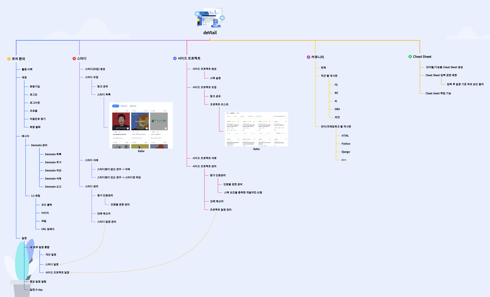

# deVtail

## 목차
[1. 목표와 기능](#1-목표와-기능) 
[2. 개발 기간](#2-개발-기간) 
[3. 팀원 소개](#3-팀원-소개) 
[4. 개발 기술, 환경 및 배포 URL](#4-개발-기술-환경-및-배포-url) 
[5. 개발 기능 목록](#5-개발-기능-목록) 
[6. DB 구조](#6-db-구조) 
[7. 주요 기능](#7-주요-기능) 
[8. 부가 기능](#8-부가-기능) 
[9. 기능 설명](#9-기능-설명) 
[10. 개발 이슈](#10-개발-이슈) 
[11. 미흡했던 점, 추후 목표](#11-미흡했던-점-추후-목표)

## 1. 목표와 기능
### 1-1 목표
- 개발자들의 스터디 모집 서비스를 제공하는 플랫폼
- 사이드 프로젝트를 위한 BE, FE 개발자 모집 플랫폼
- 개발자 간의 커뮤니티 공간 제공 플랫폼

### 1-2. 기능
- 개발자에게 최적화된 회원 관리 기능
- 스터디의 목표와 기간을 기준으로 스터디원 모집을 제공하는 기능
- 커뮤니티 게시판 이외의 개발자 간 1대1 소통 기능 (메신저 기능)
- 해당 서비스에서 제공하는 일정 이외의 일정까지 통합하여 일정을 관리해주는 기능
- 커뮤니티 게시판 기능 제공(분야별 개발자 게시판 포함)
- 분야별 참여형 Open CheatSheet 기능 제공

  
[목차로](#목차)

## 2. 개발 기간
2023.10.22 ~

  
[목차로](#목차)

## 3. 팀원 소개
- 김나영
- 김재민
- 이수빈
- 황병헌

  
[목차로](#목차)

## 4. 개발 기술, 환경 및 배포 URL
### 4-1. 개발 기술
<!-- FRONT -->

<!-- BACK -->

<!-- DB -->
<!--  -->

### 4-2. 개발 환경

### 4-3. 배포 URL

  
[목차로](#목차)

## 5. 개발 기능 목록

  
[목차로](#목차)

## 6. DB 구조

  
[목차로](#목차)

## 7. 주요 기능

  
[목차로](#목차)

## 8. 부가 기능

  
[목차로](#목차)

## 9. 기능 설명

  
[목차로](#목차)

## 10. 개발 이슈

  
[목차로](#목차)

## 11. 미흡했던 점, 추후 목표

  
[목차로](#목차)

- 일정관리
  - 달력/스케줄표/todo앱 같은 개별 일정 관리 기능
  - Jira / 일정 or 이슈 관리 기능  -> Github 연동?
  - api등으로 스케쥴 취합 관리

- 회원관리 기능
  - 개인 Profile + 이력/포트폴리오 관리 및 어필이 가능한 Template 제공

- (막연하지만) 언어별, 기능별 CheatSheet 제공
  - 깃허브의 PR같은 승인구조를 거쳐 모두가 공유할 수 있는 CheatSheet 개선, 발전, 게시
  - SQLSchool의 CheatSheet, Tutorial과 같은 결과물

- 기능
    - 계정
    - 회원가입
    - 로그인
    - 로그아웃
    - 프로필
    - 스터디 모집 게시판
    - 기본적인 게시판 기능
    - 일정 관리 기능
    - 외부 API로 일정을 반영할 수 있는 기능
    - 스터디 합류 or 생성 시 해당 스터디 일정을 자동으로 반영하는 기능
    - 개발자 커뮤니티 게시판
    - 전체 개발자 게시판
    - BE 개발자 게시판
    - FE 개발자 게시판
    - DB 개발자 게시판

회원가입
로그인
로그아웃
사용자 프로필
사용자 정보 수정
==============
스터디 만들기
스터디 관리하기
스터디원 초대하기
스터디원 관리하기
스터디 팀장표시
스터디 탈퇴
스터디 퇴출
==============
일정, 달력
깃 잔디 심으면 표시나게
게시판
채팅 (다수, 1:1)
스터디안의 챌린지
    